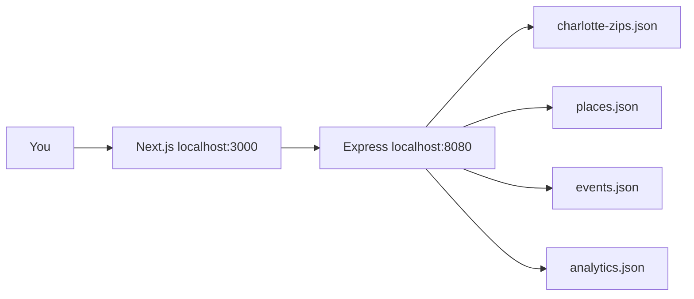

# Peaceful Places

A learning MVP for **non-medical** peace-building places and community events in **Charlotte, North Carolina only**.

This is not medical care, diagnosis, or crisis treatment. If you need urgent help in the U.S., call or text **988**.

## What you can do

- Search by a Charlotte zip code (examples on the landing page)
- Filter by price tier, noise, social energy, and age limit
- Browse static **places** (parks, libraries, lakes, craft shops, cafes)
- Browse dated **events** (5Ks, meditation, yoga, art, dance, music)
- Record lightweight, anonymous analytics for zip searches and filter clicks

Out of scope: other cities, accounts, payments, maps APIs, medical records.

## Folder structure

```text
peacefulplaces/
├── README.md
├── docs/
│   ├── ARCHITECTURE.md
│   ├── DATA-SCHEMA.md
│   ├── USER-FLOW.md
│   └── GCP-FREE-TIER.md
├── data/
│   ├── charlotte-zips.json
│   ├── places.json
│   └── events.json
├── shared/
│   └── types.ts
├── backend/                 Express API for Cloud Run
│   ├── Dockerfile
│   └── src/
└── frontend/                Next.js UI
    └── src/app/
```

## Run locally (free, no GCP account)

Needs Node 20+.

```bash
cd peacefulplaces
npm install --prefix backend
npm install --prefix frontend
```

Terminal 1:

```bash
cd backend
npm run dev
```

Terminal 2:

```bash
cd frontend
npm run dev
```

Open [http://localhost:3000](http://localhost:3000).

Try zips: **28202**, **28203**, **28205**, **28215**, **28277**.

## API

| Method | Path | Purpose |
| --- | --- | --- |
| GET | `/api/health` | Liveness |
| GET | `/api/zips` | Charlotte allow-list |
| GET | `/api/zips/:zip` | Validate one zip |
| GET | `/api/places` | Filtered static places |
| GET | `/api/events` | Filtered dated events |
| POST | `/api/analytics` | Zip search or filter click |
| GET | `/api/analytics/summary` | Simple counts |
| POST | `/api/reviews/summarize` | Gemini summary from a review array |
| POST | `/api/places/:id/summary` | Gemini summary from that place's notes |

Review summaries use `@google/genai` and `gemini-2.5-flash`. Put `GEMINI_API_KEY` in `backend/.env` only. The browser never sees the key.

## Diagrams

- Architecture (why these tools): [docs/architecture.svg](docs/architecture.svg) · [docs/ARCHITECTURE.md](docs/ARCHITECTURE.md)
- User flow: [docs/user-flow.svg](docs/user-flow.svg) · [docs/USER-FLOW.md](docs/USER-FLOW.md)

## Architecture in one picture



Later, the same API can sit on Cloud Run and the same documents can sit in Firestore. See `docs/ARCHITECTURE.md` and `docs/GCP-FREE-TIER.md`.

## Data rules

Every seed record uses a Charlotte zip from `data/charlotte-zips.json`. The API rejects any other zip.

Places stay put. Events have `startAt` / `endAt`.

## License / class use

Learning project. Venue names are public-reference examples, not partnerships.
